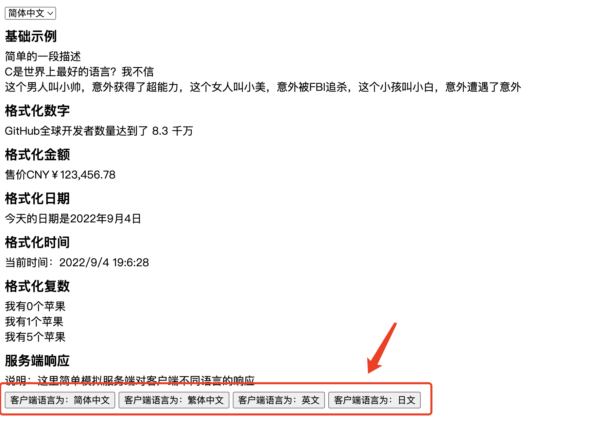
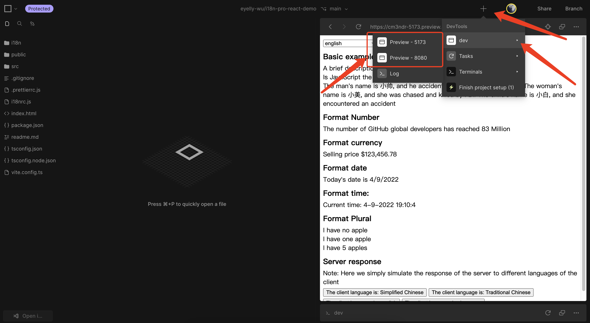
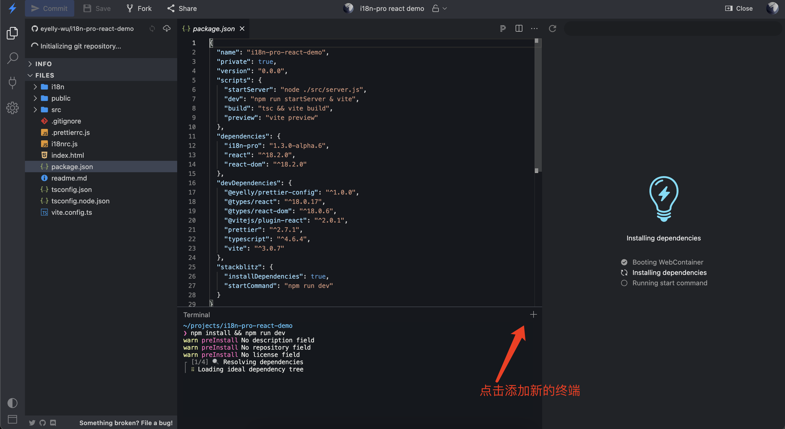

# Summary
This is a simple example of  `i18n-pro`  applied to  `React` . As the current library is a pure  `JavaScript`  library, there are no tasks related to other frameworks or library logic, so the usage in other UI libraries (such as  `Vue` ) is not different
# Special Instructions
If you want to experience the simulated server response normally, in the red part of the following figure, it is necessary to ensure that two services have been started normallyThe two services are:
1. Front end page service (port: 5173), used to display examples
2. Backend interface service (port: 8080), used to receive and corresponding click button requests


If it is currently opened through  `CodeSandBox` , both services can start normally by default, and a list of opened services can be seen in this location

If opened through  `StackBlitz` , by default only one terminal can start one service, but a new terminal can be created to start another service. The default startup is **Frontend page services (port: 5173)**

The operation to add a terminal is as follows:Enter the following command on the new terminal to start **Backend interface service (port: 8080)**
```bash
npm run server
```
